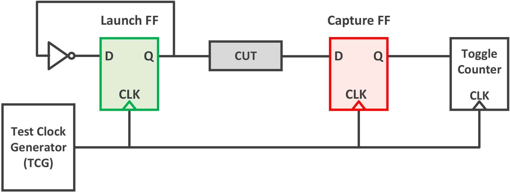
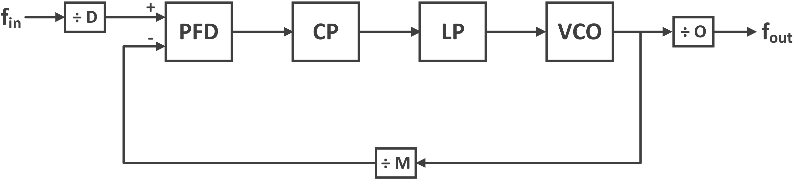
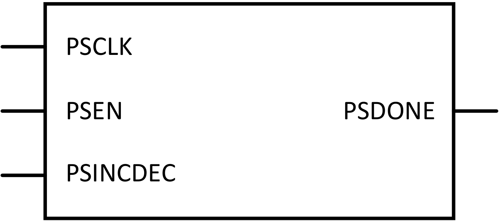
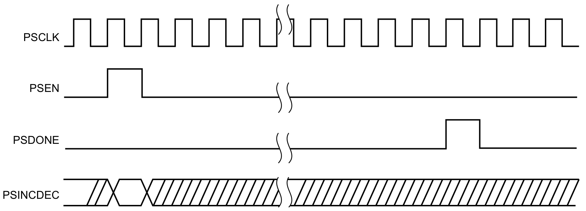
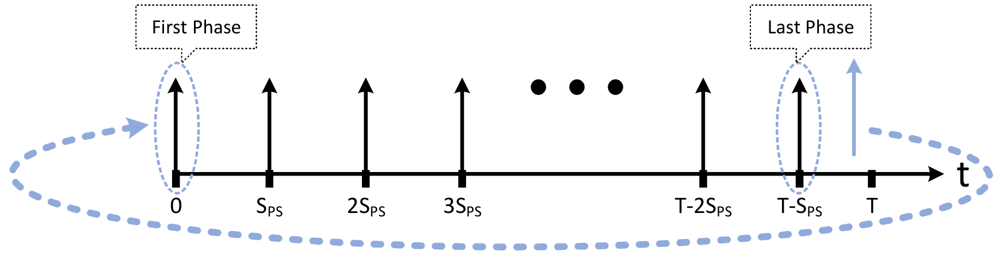
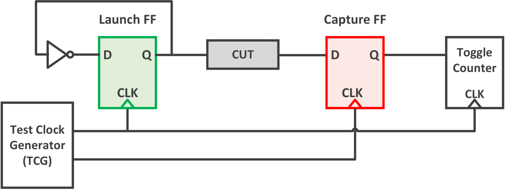

# Introduction
This project aims at detecting comment reliability issues, such as ageing and process variation in FPGAs.
Since these issues are reflected in the latency of FPGA’s resources, timing characterization is the common methodology for revealing these effects.
However, measuring the delay of each individual resource is impossible directly, so the delay of multiple resources must be measured collectively in the form of paths.

Examining the reported ageing and process variation effects in the literature shows that the increase in latency is subtle and does not exceed a few picoseconds.
In this way, a sensor with a resolution of an order of magnitude less than the delay increment is required.
In modern FPGAs like AMD-Xilinx UltraScale+ devices, a typical path delay of a few hundred picoseconds calls for a timing resolution in the range of sub-picoseconds.

|work|[^1]|[^2]|[^3]|[^4]|
|----|----|----|----|----|
Device|Cyclone II|Spartan 6|Artix 7|Artix 7|
|process|65 nm|45 nm|28 nm|28 nm|
|Method|RO|RO|RO|Short Circuit|
|Degradation|15%|5.17%|1.8%|5%|
|Duration|75 days|8 days|<13 days|50 days|

|work|[^5]|[^6]|[^7]|[^8]|
|----|----|----|----|----|
Device|Virtex V|Zynq 7|Zynq 7|Zynq US+|
|process|65 nm|28 nm|28 nm|16 nm|
|Inter-die Variation|9-12% (systematic)|17%|30%|12%|
|Intra-die Variation|5.8% (random) 15% (systematic)|7.7%|13%|9.9%|

## Characterization Circuit
Due to the abundance of resources in modern FPGAs, multiple sensors must be implemented simultaneously to characterize resources parallelly.
Accordingly, the employed sensor must have a relatively small footprint. Therefore, TDCs are not appropriate choices for this application.
The best practice to measure the delay of a path in FPGAs is shown in the figure below, where a path is surrounded by two FFs. A T-FF is in charge of generating transitions for propagating through the path, and a D-FF which samples these transitions.

Gradually increasing the operating frequency of these FFs, the setup slack of the capture FF gets smaller and smaller until it gets metastable (slack = 0). At this point, the path delay can be calculated according to the below equation:

$$ Required~Time = T - t_{setup} $$
$$ Arrival~Time = t_{delay} + t_{clk->Q} $$
$$ Setup~Slack = Required~Time - Arrival~Time + skew$$
$$ Setup~Slack = T + skew - (t_{setup} + t_{delay} + t_{clk->Q}) $$
$$ t_{delay} = T + skew - (t_{setup} + t_{clk->Q}) $$

## Resolution
The consecutive frequencies determine the sweeping step (time resolution). 
In practice, the resolution is not necessarily fixed, so the resolution is frequency dependent.
For example, if the capture FF operates properly at frequency $f$ and fails at $f + \Delta f$, the resolution is calculated according to the below equation:

$$ Resolution = \frac{1}{f} - \frac{1}{f + \Delta f} = \frac{\Delta f}{f . (f + \Delta f)} \approx \frac{\Delta f}{f^2} $$

According to [^9], a resolution of around $1~ps$ is achievable at 500 MHz using this method.

Although this method provides the required resolution, it has several major drawbacks.
Firstly, the timing resolution is not fixed and is dependent on the frequency.
Secondly, the required resolution is obtainable only in high frequencies, while operating multiple sensors in such high frequencies could increase the temperature and subsequently affect the measured delays.
Finally, FPGAs’ on-chip PLLs cannot supply frequencies beyond 800 MHz, meaning that this method is not able to measure the path delays below a specific value.

# Cascaded Phase Shifting (CPS) Method
To tackle the issues mentioned above, we propose to use phase shifting instead of frequency sweeping.
In this method, we use the dynamic phase shifting (DPS) feature of FPGAs’ clock managers (CMs).
They are able to shift the phase with a fixed step size ($S_{PS}$) either to the right or left.

This step size is a fraction of the VCO frequency of the CM’s PLL.
In US+ devices $S_{PS} = \frac{f_{VCO}}{56}$.
To gain a better understanding of how DPS works, familiarity with the internal structure of PLLs is of vital importance.

## PLL
The Figure below shows the internal structure of a PLL. 
It includes four blocks of Phase/Frequency Detector (PFD), Charge Pump (CP), Loop Filter (LF), and Voltage-Controlled Oscillator (VCO). 
The PFD compares the phases and frequencies of the input (reference) frequency and the feedback path frequency coming from the VCO.
Comparing the reference and feedback values, the PFD generates a low or high signal driving the CP, and the CP adjusts the reference voltage to the VCO.
The process of adjusting the VCO reference voltage takes a certain amount of Time until the phase/frequency difference between the reference and the VCO lies within the desired range of the PFD. 
This Time is called the lock-time of the PLL.
After resetting or changing the input frequency, the PLL needs to get locked again.

PLL also has three programmable counter dividers dividing the input, VCO, and output frequencies.
These counters have been denoted by D, M, and O and are called pre-divider, multiplier, and post-divider, respectively.
It must be noted that M divides the VCO frequency in the feedback path but appears as a multiplier in the input-output frequency relationship, which is why it is called the multiplier.

As there is negative feedback in the PLL, the coming frequencies from the reference and the VCO must be equal as shown in the equations below:

$$ \cfrac{f_{in}}{D} = \frac{f_{VCO}}{M} $$
$$ f_{VCO} = \frac{M}{D}f_{in} $$
$$ f_{out} = \frac{f_{VCO}}{O} $$
$$ f_{out} = \frac{M}{D \times O}f_{in} $$

## Dynamic Phase Shifting
The Figure below shows the control signals of the Dynamic Phase Shift (DPS) interface and the timing diagram.
The PSCLK is the reference clock, and the process of phase shifting is initiated by the assertion of PSEN for one cycle of the PSCLK.
Depending on the value of PSINCDEC, either of increment or decrement modes are deployed.
After a certain amount of the PSCLK cycles, the PSDONE is asserted for a PSCLK cycle, and the corresponding output’s phase is shifted by $S_{PS}$.
DPS can be enabled for each CM's output individually, and there is no limitation on the number of performed phase shifts. Therefore, an output can be shifted for the entire clock period (360&deg;).

The Figure below demonstrates the phase relationship between a reference output and a phase-shifted output while the mode is incremental. 
The frequencies of both outputs are the same ($f = \frac{1}{T}$), and they are in phase at the beginning. 
Notice the distance between two consecutive arrows equals the $S_{PS}$.

Although this method addresses the previous method’s drawbacks, it suffers from a poor timing resolution for conducting the timing characterization.
The resolution of this method is determined by $S_{PS}$, which is limited to $11.2~ps$ in modern FPGAs.
To tackle this issue, the resolution must be improved by more than an order of magnitude while the linearity (fixed resolution) is sustained.

## Cascaded Phase Shifting
The idea behind this scheme is to interleave multiple shifted sets of sample points to achieve a linear set of sample points with a fine resolution.

As a step smaller than $S_{PS}$ is not possible, a step equal to $S_{PS} + \frac{S_{PS}}{N}$ can be used. 
Generating $N$ shifted sets using this step and combining them, we can generate a superposition set of sample points spread $\frac{S_{PS}}{N}$ apart.
The Figure below illustrates an example of this scheme for $N = 4$. As can be seen, the sample points within each set are equally distributed by $S_{PS}$. 

To realize this scheme, the cascaded structure shown in the Figure below is proposed. 
Working in the incremental mode, CM1 is responsible for generating the coarser phase shift step among the sets ($1 + \frac{1}{N}S_{PS}$), while CM2 takes care of the fine phase shift steps ($S_{PS}$) within a set.
Since CM1 must only shift the launch clock’s phase, the capture clock is isolated using CM3. 
Therefore, CM1 generates two reference clocks with the same frequency for CM2 and CM3 and performs the DPS only on CM2’s reference clock. 
CM2 and CM3 are set equally, but DPS is only activated for CM2.

## Resolution
The resolution of the cascaded structure equals the absolute difference between the two phase shift steps. 
Substituting $\frac{T_{VCO}}{56}$ for phase shift steps, we can define the relationship between the VCO frequencies of CM1 and CM2 according to the equations below.

$$ \mid S_{PS_1} - S_{PS_2}\mid = \cfrac{S_{PS_2}}{N} $$
$$ \mid \cfrac{T_{VCO_1} - T_{VCO_2}}{56}\mid = \cfrac{T_{VCO_2}}{56 \times N} $$
$$\begin{dcases}
      T_{VCO_1}= \cfrac{N+1}{N} T_{VCO_2}\\
      T_{VCO_1}= \cfrac{N-1}{N} T_{VCO_2}
    \end{dcases}$$
$$ \begin{dcases}
      f_{VCO_1}= \cfrac{N}{N+1} f_{VCO_2}\\
      f_{VCO_1}= \cfrac{N}{N-1} f_{VCO_2}
    \end{dcases} $$

 where N is the improvement factor by which the resolution of a single CM is improved. 
As can be seen, the resolution is tunable by choosing the proper values for the VCO frequencies of CM1 and CM2.

For instance, in AMD Xilinx UltraScale+ devices, the highest achievable resolution is $11.2 ps$ corresponding to $f_{VCO}=1600 MHz$. 
If a resolution of $2.8 ps$ is required ($N = 4$), there are two possible values for CM1’s VCO frequency according to~\equ{eq:freq_relation}: $1280 MHz$ and $2133 MHz$, among which only $1280 MHz$ is valid. 
Therefore, $f_{{VCO}_1} = 1280 MHz$ and $f_{{VCO}_2} = f_{{VCO}_3} = 1600 MHz$.

# References
[^1]: E. A. Stott, J. S. Wong, P. Sedcole, and P. Y. Cheung, “Degradation in FPGAs: measurement and modelling,” in Proceedings of the 18th annual ACM/SIGDA international symposium on Field programmable gate arrays, 2010, pp. 229–238.
[^2]: A. Amouri, F. Bruguier, S. Kiamehr, P. Benoit, L. Torres, and M. Tahoori, “Aging effects in FPGAs: An experimental analysis,” in 2014 24th international conference on Field Programmable Logic and Applications (FPL). IEEE, 2014, pp. 1–4.
[^3]: M. Slimani, K. Benkalaia, and L. Naviner, “Analysis of ageing effects on ARTIX7 XILINX FPGA,” Microelectronics Reliability, vol. 76, pp. 168–173, 2017.
[^4]: T. Gaskin, H. Cook, W. Stirk, R. Lucas, J. Goeders, and B. Hutchings, “Using Novel Configuration Techniques for Accelerated FPGA Aging,” in 2020 30th International Conference on Field-Programmable Logic and Applications (FPL). IEEE, 2020, pp. 169–175.
[^5]: T. Tuan, A. Lesea, C. Kingsley, and S. Trimberger, “Analysis of withindie process variation in 65nm FPGAs,” in 2011 12th International Symposium on Quality Electronic Design. IEEE, 2011, pp. 1–5.
[^6]: K. Maragos, G. Lentaris, D. Soudris, K. Siozios, and V. F. Pavlidis,
“Application performance improvement by exploiting process variability on FPGA devices,” in Design, Automation Test in Europe Conference Exhibition (DATE), 2017, 2017, pp. 452–457.
[^7]: K. Maragos, G. Lentaris, and D. Soudris, “In-the-field mitigation of process variability for improved FPGA performance,” IEEE transactions on Computers, vol. 68, no. 7, pp. 1049–1063, 2019.
[^8]: K. Maragos, E. Taka, G. Lentaris, I. Stratakos, and D. Soudris, “Analysis of Performance Variation in 16nm FinFET FPGA Devices,” in 2019 29th International Conference on Field Programmable Logic and Applications (FPL). IEEE, 2019, pp. 38–44.
[^9]: J. S. Wong, P. Sedcole, and P. Y. Cheung, “Self-characterization of Combinatorial
Circuit Delays in FPGAs,” in 2007 International Conference on Field-Programmable
Technology, IEEE, 2007, pp. 17–23.
