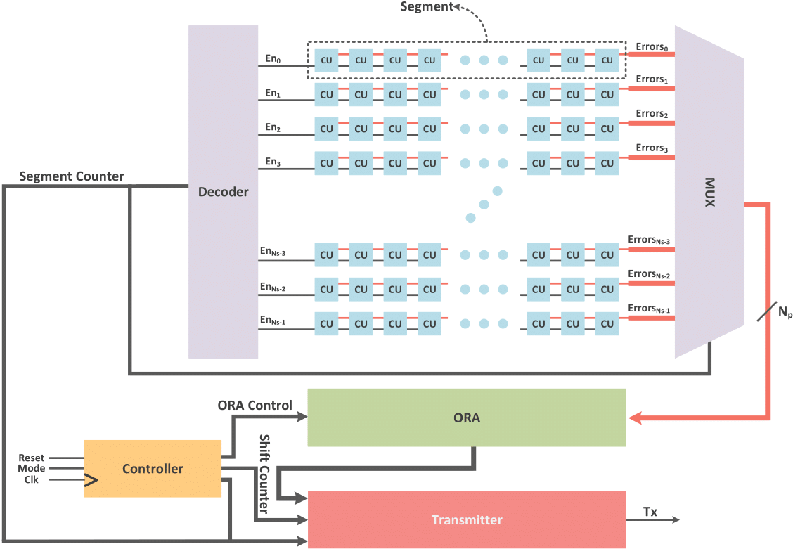

# Introduction
This project aims at measuring delays of multiple paths in an FPGA. 
Each Characterization Unit (CU) includes a T-FF as a Test pattern Generator (TPG), a Circuit Under Test (CUT), and a D-FF for sampeling the propagated transitions from TPG through the CUT.

All paths that are supposed to undergo test are arrenged in a segmented structure as shows in the figure below.
All segments are tested in sequence while all CUs in a segment are tested simultaneously.
The results are processed by the Output Response Analyzer (ORA), and appropriate information corresponding to each CUT is transfered to the Transmitter, which includes a FIFO and a UART controller for pumping data out of the chip.



# Prerequisits
* Vivado 2021.1
* Xilinx ZYNQ UltraScale+ XCZU9EG MPSoC ([Trenz TE080-03](https://shop.trenz-electronic.de/trenzdownloads/Trenz_Electronic/Modules_and_Module_Carriers/5.2x7.6/TE0808/REV03/Documents/TRM-TE0808-03.pdf))
* Appropriate physical constraints for all test configurations

# Usage
1- First clone the repository
```
git clone https://github.com/bardia-ab/Cascaded_Phase_Shifting.git
```

2- change the directory
```
cd CPS_Parallel_ZCU9
```

3- source the Tcl script
```
vivado -mode batch -nolog -nojournal -source CPS_Parallel_ZCU9.tcl
```